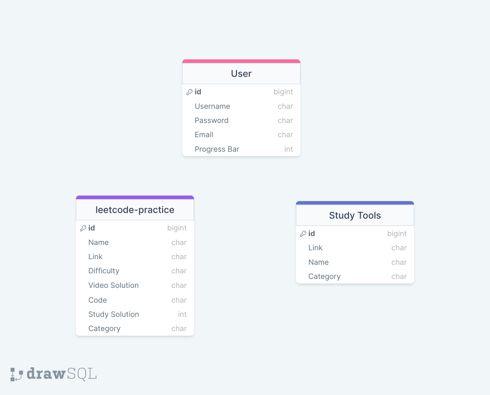

## codeAlong

---

This is web application was made to help future Software Engineers learn about data structures, algorithms, and other concepts. When I finished my bootcamp, I struggled to learn about these concepts outside of school. It was difficult to structure lessons and find the right materials. So, I decided to make it easier for other engineers who want to learn by providing them with an all-in-one website of materials I wish I had. This website was heavily inspired by Neetcode.io!

Getting Started

---

Deployment - TBD

Technologies Used

---

- Frontend - Django, HTML, CSS, and JavaScript
- Backend - Python
- Database - PSQL

## User Stories

---

- [ ] AAU, I should be able to sign-up, login, and log out
- [ ] AAU, I should be able to Read and utilize the 75 blind questions
- [ ] AAU, I should be able to copy the solutions to the 75 blind questions in Python and JavaScript
- [ ] AAU, I should be able to Read, Update, Reset my progress bar for the blind questions that I have completed.
- [ ] AAU, I should be able to Read a list of study guides (I.E., Youtube Videos, PDFS of books, Websites)
- [ ] AAU, I should be able to Read the roadmap of materials to learn(Icebox)
- [ ] AAU, I should be able to Update darkmode/lightmode(Icebox)

## Entity Relational Dabase

## 

Future Enhancements

---

# Docker
- from the root directory run `docker-compose build`
- then to run the application `docker-compose up -d`
- if you make a change that required rebuilding the container i.e. adding a python library to requirements.txt:
  - `docker-compose down`
  - `docker-compose build`
  - `docker-compose up -d`
- if you run into permission issues when trying to run docker-compose build, delete the /data directory (`rm -rf data/`), you may need to use sudo `sudo rm -rf data/`
